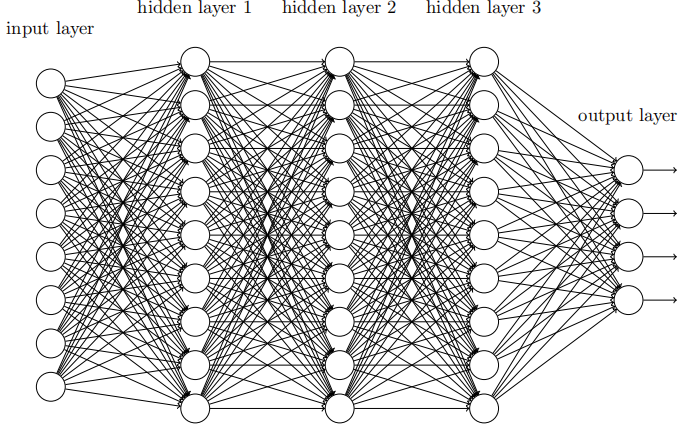
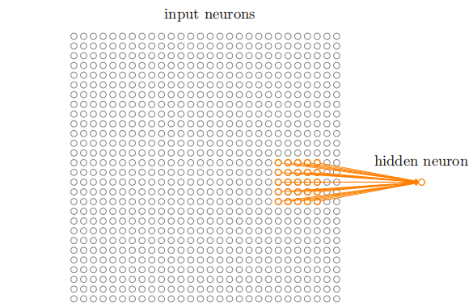
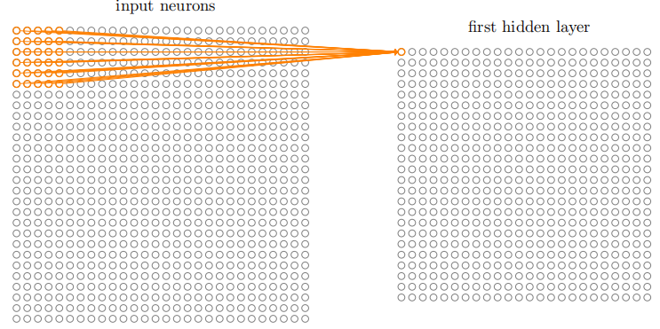
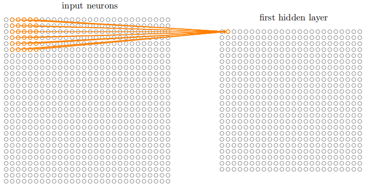
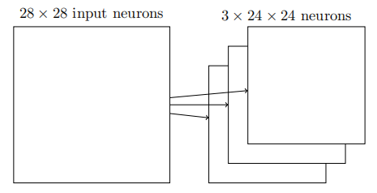
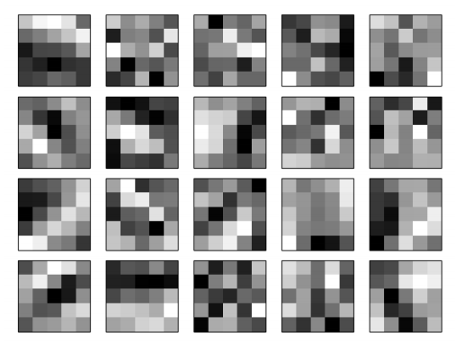
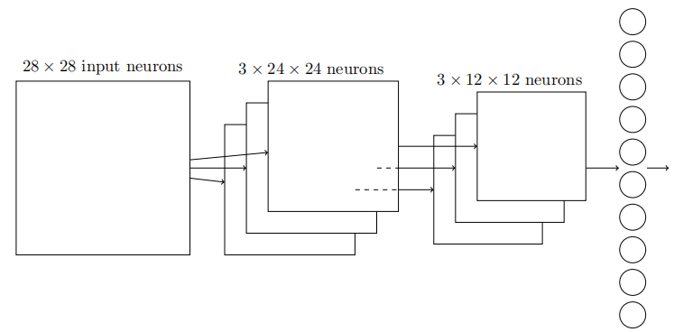

# CNN基本流程

## 引言

本文将介绍卷积神经网络的基本结构，它与神经网络在输入层、隐藏层、输出层都有所不同。

## 卷积神经网络基本结构

本节将介绍卷积神经网络网络的各个层的设计思想、作用、原理。

最基本的神经网络结构如下：使用全连接的邻接关系的网络，即网络中前一层的每个神经元都与相邻层上的每个神经元连接。

基本概念：

**局部感受野(local receptive fields)**：

上面的神经网络的输入层是一列**纵向**排列的神经元，而在卷积神经网络中，输入将是**方形**排列的神经元。例如手写数字识别中，将784个输入神经元改为28x28的方形输入,如下图的橙色区域就是一个**局部感受野**，而由输入层与下一层不再是全连接，传入下一层神经元的是一个局部感受野。

**这样做的原因**：全连接的网络不考虑图像的空间结构，它在完全相同的基础上对待图像的每一块像素，导致空间结构必须从训练数据中推断。而卷积神经网络设法利用了已有训练数据的空间架构，使得卷积网络能更快训练。

**特征映射：**一个一个的局部感受野向隐藏层一个一个对应神经元传递数据的过程称作特征映射。

以下是输入层向第一层隐藏层进行特征映射的过程：

​		输入层的第**1**个局部感受野向隐藏层第一层的第**1**个神经元进行特征映射：

​		输入层的第**2**个局部感受野向隐藏层第一层的第**2**个神经元进行特征映射：

其中涉及到了卷积运算的过程，卷积运算中有几个参数需要了解：卷积核(filter)、步长(stride)、深度(depth)，具体的卷积运算过程稍后再补充。

**卷积核(滤波器)：**

在特征映射的过程中，会有共享权重和共享偏置（就像神经网络中介绍的权重和偏置），卷积核就是由**共享权重**和**共享偏置**组成的。下图就是一个28x28的图像进行3层特征映射后得到的结果，是一个3x24x24（采用5x5的卷积核，3层深度，步长为1，28-5+1=24，即24x24x3）的特征组合。

下图是特征映射结果的直观图：20幅图像对应20个不同的特征映射(卷积核)，每个映射有一副5x5的图像表示，对应于局部感受野中的5x5权重，颜色浅代表权重小，反之代表权重大。**从中可以得出结论**，卷积网络在学习和数据空间结构相关的东西。

**共享权重和共享偏置的作用**：减少了参与卷积网络的参数，提取特征，加快卷积模型的训练。

**池化(pooling)：**

池化层通常在卷积层之后，**作用**就是简化卷积层的输出信息，（1）使特征图变小，简化网络计算复杂度；（2）特征压缩，提取主要特征。

**全连接层**

连接所有的特征，即将池化层的每一个神经元连接到每一个输出神经元，输出分类结果。

下图是完整的卷积神经网络的结构图：

​              输入层                                            卷积层                                         池化层             全连接(输出)层

## 总结

​		卷积神经网络同前面说的神经网络的架构有所不同，但总体描述和目标是相似的：都是由很多简单的单元构成的网络，每个单元的行为由权重和偏置决定，就是通过训练数据来训练出合适的权重和偏置，使其能够实现分类任务。
